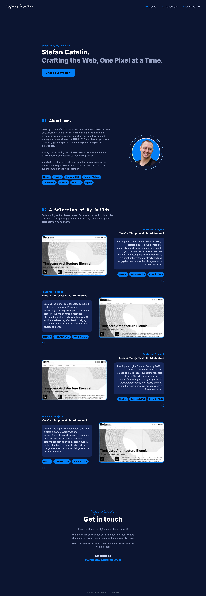

# Single Page Personal Portfolio

Welcome to the repository for my personal portfolio! This project is built using Next.js with TypeScript, styled using the Tailwind CSS utility-first framework, and designed to be a simple, yet appealing single-page portfolio.



Feel free to fork, modify, and use this project as a template for your own portfolio.

## Tech Stack

- [Next.js](https://nextjs.org/)
- [TypeScript](https://www.typescriptlang.org/)
- [Tailwind CSS](https://tailwindcss.com/)

## Getting Started

First, clone the repository:

```bash
git clone https://github.com/yourusername/your-repo-name.git

Then, install the dependencies:

npm install
# or
yarn

To run the development server:

npm run dev
# or
yarn dev

Open http://localhost:3000 with your browser to see the result. The page auto-updates as you make edits.

You can start editing the page by modifying pages/index.tsx.

Learn More
To learn more about the technologies used in this project, visit the following resources:

Next.js Documentation - Learn about Next.js features and API.
TypeScript Documentation - Understand TypeScript and its features.
Tailwind CSS Documentation - Get started with utility-first CSS framework.
Deployment
To deploy your Next.js app, the Vercel Platform from the creators of Next.js provides an intuitive solution.

For more details, check out the Next.js deployment documentation.

Contributing
Contributions, issues and feature requests are welcome!

License
This project is open source and available under the MIT License.


Just replace "yourusername" and "your-repo-name" with your GitHub username and your repository name. Make sure to upload a screenshot of your portfolio to the public folder and update the link in the README file to point to your screenshot. You could name it 'portfolio_screenshot.png' or any name of your choice.
```
